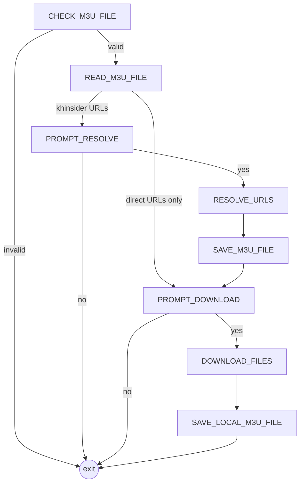

<div align="center">

# m3ud

**Download every track in an M3U playlist with a single command.**

[](https://deno.com)
[](https://www.typescriptlang.org)
[](https://github.com/argenkiwi/ambler-ts)

[Features](#features) • [Getting started](#getting-started) • [How it works](#how-it-works) • [Development](#development)

</div>

m3ud reads an `.m3u` playlist and downloads all the files it lists into a local folder, in parallel. It then writes a new playlist that points at the downloaded copies. If the playlist links to [khinsider](https://downloads.khinsider.com) track pages, m3ud resolves each one to its direct MP3 link before downloading.

## Features

- **Parallel downloads.** Every file in the playlist is fetched at the same time and streamed straight to disk.
- **khinsider support.** Track-page URLs are resolved to their direct MP3 download links.
- **Local playlist.** A `playlist.m3u` file is written next to the downloads, using `file://` URIs.
- **Confirms first.** Nothing is resolved or downloaded until you answer `y`. It also works with piped input, so you can script it.
- **Small, tested steps.** Each step is an [Ambler](https://github.com/argenkiwi/ambler-ts) node with its own unit tests.

## Getting started

### Prerequisites

- [Deno](https://deno.com) 2.8 or later (m3ud uses `import defer`)

### Usage

```sh
git clone https://github.com/argenkiwi/m3ud.git
cd m3ud
deno task m3ud path/to/My\ Album.m3u
```

m3ud prints the URLs it found, asks for confirmation, and downloads everything:

```text
URLs in My Album.m3u:
  https://example.com/01.mp3
  https://example.com/02.mp3
Proceed with download? (y/n) y
Downloading 2 file(s) to My Album...
Saved My Album/playlist.m3u:
  file:///…/My%20Album/01.mp3
  file:///…/My%20Album/02.mp3
```

The downloads go in a folder named after the playlist, created next to it:

```text
My Album/
├── 01.mp3
├── 02.mp3
└── playlist.m3u
```

> [!WARNING]
> The original `.m3u` file is **deleted** once every download succeeds, because the new `My Album/playlist.m3u` replaces it. If any download fails, the run stops and the original file is left as it was.

> [!NOTE]
> Blank lines and lines starting with `#` (including `#EXTM3U` and `#EXTINF` metadata) are ignored. The new playlist contains only URIs.

### khinsider playlists

Any URL that starts with `https://downloads.khinsider.com/game-soundtracks` is treated as a track page. m3ud asks before resolving these links. It then overwrites the original playlist with the direct MP3 links, so you can inspect them before choosing whether to download.

> [!TIP]
> Answer `n` at the download prompt to only resolve the links. The playlist is saved with the direct URLs, and you can run m3ud on it again later to download them.

> [!IMPORTANT]
> khinsider is behind Cloudflare, which sometimes blocks automated requests with a challenge page. When that happens, resolution fails with a `Failed to fetch … 403` error.

### Permissions

The `m3ud` task runs with `--allow-read --allow-write --allow-net`. m3ud needs these to read the playlist, write the downloads and the new playlist, and fetch the files.

## How it works

m3ud is an [Ambler](https://github.com/argenkiwi/ambler-ts) walk: a small state machine where each step is a node that reads the shared state and returns the next step to run.



The full behaviour of each step is described in [`specs/m3ud.md`](specs/m3ud.md).

### Project structure

```text
ambler.ts        # Ambler state-machine runtime
walks/m3ud.ts    # Wiring: shared state and the node graph
nodes/           # One file per step, plus tests in nodes/tests/
utils/           # Side-effectful helpers (fetching, downloading, prompting)
specs/m3ud.md    # Specification of the walk
notes/           # Design notes and gotchas
```

## Development

Run the unit tests:

```sh
deno test nodes/tests/
```

Type-check and lint:

```sh
deno check walks/m3ud.ts
deno lint
```

Each node takes its side effects (file I/O, network, stdin) through an injectable `Utils` object, so the tests mock them all and never touch the disk or the network.
